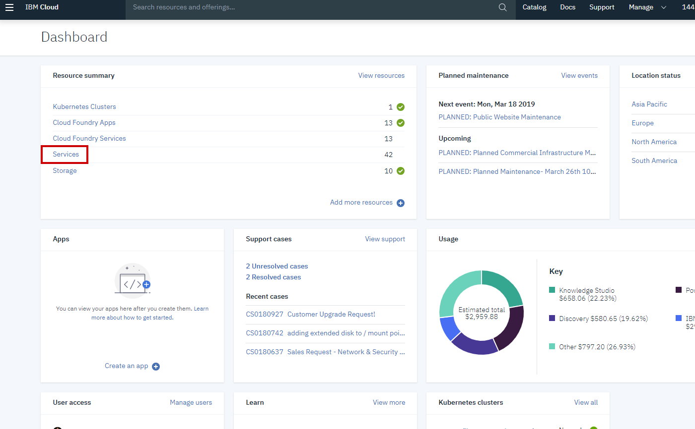
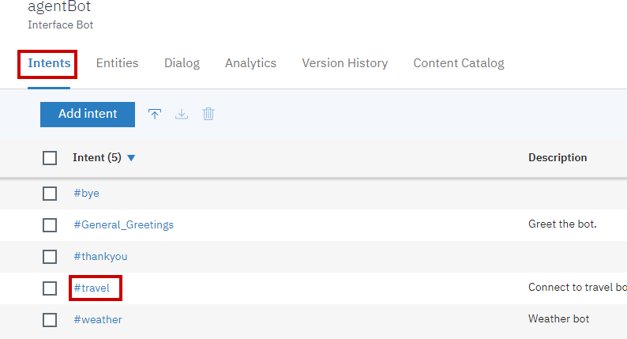
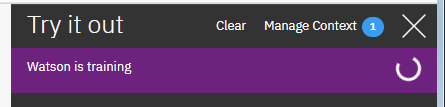
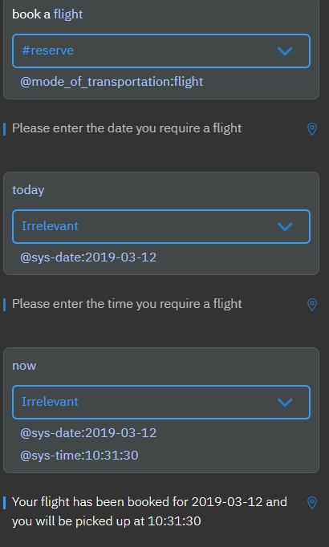

bot# Compose domain specific bots using an agent bot
A domain specific bot can address queries related to a specific domain. Examples of a domain specific bot could include a travel bot used for booking cabs and a weather bot used for getting weather forecasts. 

There are scenarios where an user wants to accomplish a task involving multiple domains. When I want to travel somewhere, I may want to check the weather prior to booking travel. To accomplish this, I will need to reach out to a weather bot and a travel bot. What if I could go to a single agent bot that could handle both weather and travel requests? This agent bot would serve as a proxy to domain specific bots. 

This code pattern showcases an implementation of this approach.

You will create an agent bot and a few domain specific bots. The agent bot knows enough about each domain that it can route incoming messages to the correct domain specific bot. When users  interact with the agent bot, their messages will be sent to the appropriate domain bot through the language classification power of Watson Assistant. When the conversation with a domain bot is over or when the domain bot is not able to handle the request, the conversation will be handed over to the agent bot which will then redirect messages to the next appropriate bot.

This approach provides a seamless experience for users. It can be used by organisations which provide a host of services to its customers across various domains.

Advantages with this approach are:
- bots can be added via a plug and play fashion
- Modular approach facilitates bot composition
- Simpler individual bots are easier to maintain and modify vs complex bots
- Troubleshooting becomes easier due to domain isolation

In this code pattern we will use the [Watson Assistant](https://cloud.ibm.com/catalog/services/watson-assistant) service on [IBM Cloud](https://cloud.ibm.com/) to build the bots and a Node.js application as the orchestration layer. We will host our Node.js application in IBM Cloud using Cloud Foundry.

When you have completed this Code Pattern, you will understand how to:

* Import existing bots into Watson Assistant
* Integrate an application with Watson Assistant bots
* Extend functionality of existing bots

## Flow


1. User accesses the web application and types in a message. The application sends user message to agent bot.
2. Agent bot determines the domain and responds with details about the specific bot to which the message needs to be redirected.
3. Node.js application sends message to the relevant domain specific bot (Weather). Conversation continues between user and weather bot.
4. When the conversation with specific bot is over, user message is then sent to agent bot to determine the next domain.
5. Node.js application sends message to the relevant domain specific bot (Travel). Conversation continues between user and travel bot.


# Watch the Video
[](https://youtu.be/godEYin0IYA)

# Steps
1. Clone git repo.
2. Create bots.
3. Configure application with bots details.
4. Deploy application to IBM Cloud.
5. Run application.
6. Improve the bots

## 1. Clone git repo

- Navigate to the folder you'd like to store this demo repository (e.g. `Documents`)
- On command prompt run either of the below commands to clone the git repo.
```
git clone git@github.com:IBM/watson-assistant-multi-bot-agent.git
```
or
```
git clone https://github.com/IBM/watson-assistant-multi-bot-agent.git
```
- Once you've successfuly cloned the repository. Run `cd watson-assistant-multi-bot-agent` to navigate to the root folder of the repository

## 2. Create bots

### 2.1 Create Watson Assistant service instance
- Ensure you are logged into [IBM Cloud](https://cloud.ibm.com).
- Click this [link](https://cloud.ibm.com/catalog/services/watson-assistant) to create an instance of the Watson assistant service.
- You can choose to enter any name you like under `Service Name`, such as `Watson-Assistant-Service`. 
- Set the region to `Dallas`, and  the resource group to `default`. 
- Under `Pricing Plans`, select `Lite` plan.
- Your screen should look like this:

- Click `Create`.
- You should now be redirected to the Watson Assistant instance page.  


### 2.2 Import bots
- If you are not redirected to the Watson Assistant instance page, you can navigate to it by following these steps:
    - Go to the IBM Cloud [dashboard](https://cloud.ibm.com)
    - In the dashboard, click on `Services` to open the services page.
    
    - In the services page, click on the Watson Assistant service instance you created earlier to launch the Watson Assistance instance page.
    
- On the Assistant instance page, click `Launch Tool`.


- Click the `Skills` tab.

- Click `Create New` button.
- Click the `Import Skill` tab.

- Click `Choose JSON file`.
- In your file explorer, navigate to the cloned repository parent folder, `watson-assistant-multi-bot-agent`
- Browse to folder `WA`.
- Select `agent-bot.json` and click `Open`.
- Select the option `Everything (Intents, Entities, and Dialog)`.

- Click `Import` button.
- Navigate back to the `Skills` page and repeat above steps in section [Import bots](#22-import-bots) to import `travel_bot.json` and `weather_bot.json`.

## 3. Configure application with bots details
### 3.1 Gather required details
- If not already in the `Skills` tab of the your Watson Assistance service instance,
    - Go back to the IBM Cloud [Services page](https://cloud.ibm.com/resources?groups=resource-instance) and click on your Watson Assistant service instance
    - On the Watson Assistant Dashboard instance page, click `Launch Tool`.
    - Click `Skills` tab.

- Click the three vertical dots in the top right corner of the `agentbot` listeing then click `View API Details`.  

- Copy and save `Workspace ID` for in a text file for later use, along with a note about which bot it came from.
- Repeat the above steps for weatherbot and travel bot. You should end up with 3 workspace IDs.
- Go back to your Watson Assistance Service instance page(on [cloud.ibm.com](https://cloud.ibm.com)).
- Record the values for `API Key` and `Url` by using the copy buttons as shown in below image or using clicking `Show Credentials` and manually copying the field contents. Save them in a text file for later use.


### 3.2 Update manifest.yml file with the details gathered
- In the `watson-assistant-multi-bot-agent` project parent folder, open `manifest.yml` using a text editor
- Update `ASSISTANT_IAM_API_KEY` with Watson Assistant service instance's API Key as noted in section [Gather required details](#31-gather-required-details)
- Update `ASSISTANT_IAM_URL` with Watson Assistant service instance's Url as noted in section [Gather required details](#31-gather-required-details)
- Update `WORKSPACE_ID_AGENT`, `WORKSPACE_ID_TRAVEL`, `WORKSPACE_ID_WEATHER` with Workspace IDs of respective bots as noted in section [Gather required details](#31-gather-required-details)

Your updated `manifest.yml` file should look like the image below. Make sure to have a space after the colon. Save and close the file.


## 4. Deploy application to IBM Cloud
- Using the command prompt, navigate to project's root folder (`watson-assistant-multi-bot-agent`)
- In the command prompt, login to IBM Cloud using the IBM Cloud CLI:  
```
ibmcloud login -a cloud.ibm.com
```
or for federated login
```
ibmcloud login --sso
``` 
- Provide your IBM ID email and password, and select `us-south` as your region.
- In the command prompt, run the `ibmcloud target --cf` command to select your Cloud Foundry organization and space.
- From the project's root folder (`watson-assistant-multi-bot-agent`) run:  
 ```
 ibmcloud cf push
 ```  
 to deploy the application to IBM Cloud as a Cloud Foundry application.
- You can check the logs of the application using the command:   
```
ibmcloud cf logs <app_name> --recent
```
- Ensure that the application is deployed to IBM Cloud successfully. If you see any errors in logs, fix them and redeploy the application.
    - If the above steps don't work, try the following:
    - Sign into us-south: 
    ```
    ibmcloud login -sso -a api.ng.bluemix.net
    ```
    - Set target: 
    ```
    ibmcloud target --cf
    ```
    - Try a cf push :
    ```
    ibmcloud cf push
    ```
## 5. Run the application
- [Login](https://cloud.ibm.com/) to the IBM Cloud Dashboard and click on `Cloud Foundry Apps`. Within `Cloud Foundry Apps`, the application you deployed should show up and it should be in running state.  

- Click on the application listing in `Cloud Foundry Apps` and click on `Visit App URL`.

- The application home page will opens.

- Using the command prompt, monitor the application's logs with:  
```
ibmcloud cf logs watson-assistant-multi-bot-agent
```
* _Note: if the application fails to recognize your query, wait several minutes. Watson may still be training in the background._

- On the application home page type a weather related query `What does the weather look like tomorrow?`.

- Check the log files and notice that the message first goes to the Agent bot and then it is redirected to the Weather bot. 

- In the interface, you are asked to enter a location for the forecast. Enter a location, e.g. `Bengaluru`.
- Check the logs. Because the conversation with the Weather bot is ongoing, Weather bot retains control of the conversation.

- The Weather bot responds with an answer to the user's query and conversation control returns to the Agent bot.
- Next enter a travel related query `Book a cab`.
- In the logs, notice that the message is sent to Agent bot and then it is redirected to Travel bot.

- In the interface you are asked to enter a date for cab booking. Enter a date or you can just say `Today`.
- Because the conversation with the Travel bot is ongoing, Travel bot retains control of the conversation.

- In the interface you are asked to enter time for the cab to arrive. Say `12 PM`.
- Check the logs. Since Travel bot has responded with an answer, control returns to the Agent bot.
- The conversation continues and the Agent bot will redirect  messages to the appropriate bot based on the intent of the user query
- General intents such as greetings and goodbye can be handled by the Agent bot itself.
- In the interface type `Thank you. Bye`

- The complete conversation message flow is detailed below:

  Legend for above image
  1. Message sent to Agent bot.
  2. Message redirected to Weather bot.
  3. Response from Weather bot.
  4. Message sent to Weather bot.
  5. Response from Weather bot (end of conversation with Weather bot, control returns to Agent bot).
  6. Message sent to Agent bot.
  7. Message redirected to Travel bot.
  8. Response from Travel bot.
  9. Message sent to Travel bot.
  10. Response from Travel bot.
  11. Message sent to Travel bot.
  12. Response from Travel bot (end of conversation with Travel bot, control returns to Agent bot).
  13. Message sent to Agent bot.
  14. Response from Agent bot (end of conversation).
## 6. Improve the bots
Currently, each bot is configured to use keywords in order to determine a user's meaning. While this approach makes it easy to get started, it doesn't take full advantage of the machine learning capabilities of Watson Assistant. As a result, the bots won't be able to infer meaning if none of the keywords exist in the user's input. This could also lead to some unintended results!
### 6.1 Test agentbot
- Go to the Watson Assistant `Skills` tab and click on `agentBot`

- Open the `Try it panel` by clicking the `Try it` button in the upper right hand corner of the screen.

- You can use the `Try it` panel to send messages to `agentBot` and see what `intents` and `entities` are recognized. `Intents` are sentence level classifications while `entitites` are phrase level classifications. `Intents` and `entities` serve as the building blocks for a bot's logic.
- Send the sentence: "book a cab". `agentBot` will recognize the `#travel` intent. When `agentbot` finds the `#travel` intent, it signals a transfer to `travelbot`.

- Send the sentence: "I want a cab". `agentBot` will not recognize the `#travel` intent, because the `#travel` intent is trained on keywords relating to travel that doesn't currently include `cab`.

- Send the sentence: "get". `agentbot` recognizes the `#travel` intent, even though `get` is NOT part of our examples for `#travel`.  

### 6.2 Improve agentbot
- Within the `agentbot` skill, click the `Intents` tab and click the `#travel` intent to open up `intent details`.

- Within the `intent details` for the `#travel` intent, we can see that the `user examples`(training data) doesn't include mentions of `flight`, `cab`, or `taxi`. Since the current set of user examples are all keywords, the underlying model is weighted towards short phrases and the specific set of keywords. Since `cab` isn't listed as an example, "I want a cab" wasn't classified as `#travel`. This could also explain why "get" was incorrectly classified as `#travel`.  

- Add the following words to the `User examples` for the `#travel` intent of the `agentBot` skill. Since `agentBot` serves as a proxy to `travelBot`, keyword intents will suffice.
  1. `cab`
  2. `taxi`
  3. `flight`
- As you add examples, the `Try it out` panel will update to show that your workspace training is being updated  

- Once the `Watson is training` notification has disappeared, use the `Try it out` panel to send the sentences: `I want a cab` and `Get me a flight`. both sentences should be correctly classified as `#travel`.
### 6.3 Teach travelbot to Fly
Now that `agentBot` can better identify requests for travel, we need to ensure that `travelBot` can handle flight reservation requests.
- From the Watson Assistant `Skills` menu, select the `travelBot` skill.
- Click on the `Dialog` tab of the `travelBot` skill to access the logic of `travelBot`. 
- Using the `Try it out` panel, send the message: "I want to book a flight". `travelBot` should classify the message as `#reserve` and should identify the entity of `@mode_of_transportation:flight`. 
- We will duplicate the the `Book Cab` node to enable `travelBot` to arrange flight reservations. Click the  on the `Book Cab` dialog node then click `Duplicate`.  

- The resulting node will be called `Book Cab - copy1`

- Click on the `Book Cab - copy1` node and change it's name from `Book Cab - copy1` to `Book Flight`. To ensure that the node is activated when users ask about reserving flights, change its trigger condition from   
`#reserve` `and` `@mode_of_transportation:cab`    
to  
`#reserve` `and` `@mode_of_transportation:flight`  
This set of conditions will ensure that the node triggers whenever the `#reserve` intent is detected alongside the `@mode_of_transportation` entity with a value of `flight`.  
- The `Book Flight` dialog node should look like below:  

- Update the `If not present, ask` text prompts for `$cabRequiredDate` and `$cabRequiredTime` to mention flight instead of cab. Update variable names from `$cabRequiredDate` and `$cabRequiredTime` to `$flightRequiredDate` and `$flightRequiredTime`
- Update the `Book Flight` node's response to `Your flight has been booked for $flightRequiredDate and you will be picked up at $flightRequiredTime`. 

- Use the try it out panel to request a flight reservation. You will need to provide a date and a time for your reservation.   

# Plug and play process for a new bot

1. To add a new bot, create a new bot in the Watson Assistant service instance created earlier for this code pattern or you can use an existing bot that you want to use. Let's say you added a bot for `Restaurant Booking` and named it as `RESTAURANT_BOOKING`.
2. In `manifest.yml` file, add an entry for new bot as shown below
```
WORKSPACE_ID_RESTAURANT_BOOKING: xxxxxxxxxxxxxxxxxxxxxxxx
```
3. In the RESTAURANT_BOOKING bot, when the conversation is over (last node in a dialog), add a context parameter `destination_bot` and value as `AGENT`. It enables the control to be passed to back to the Agent bot. You can refer to the leaf nodes in other already imported bots for examples.
4. Open Agent bot. Add an intent for Restaurant Booking, say restaurant. Then in dialog, add a node for restaurant intent. Add a context parameter `destination_bot` and value as `RESTAURANT_BOOKING`.
5. Redeploy the application for the configuration changes to take effect.
6. That's it, you are set to you new `RESTAURANT_BOOKING` bot as a plug and play bot.


# Summary
We introduced an Agent bot which understands intents of messages. Agent bot will redirect a message to a specific bot which can handle that message. We saw how to configure Agent bot, Specific Bots and orchestration application to have this arrangement possible. We also saw how to plug and play this setup to add a new bot.


# Troubleshooting

* The application page displays but there is no greetings message, when the application pages loads.
  * Verify Watson Assistant username and password are correct.
  * Verify workspace_id of the agent bot is correct.

* No response for a chat message
Verify workspace_id of a specific bots is correct.

* If there is any other issue, check application logs using the below command
```
ibmcloud cf logs <app-name> --recent
```


# License
[Apache 2.0](LICENSE)
